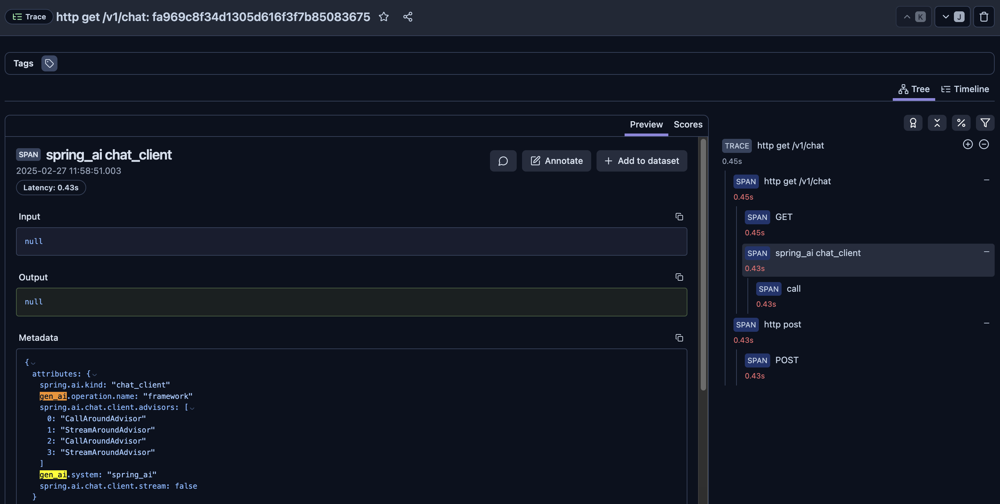
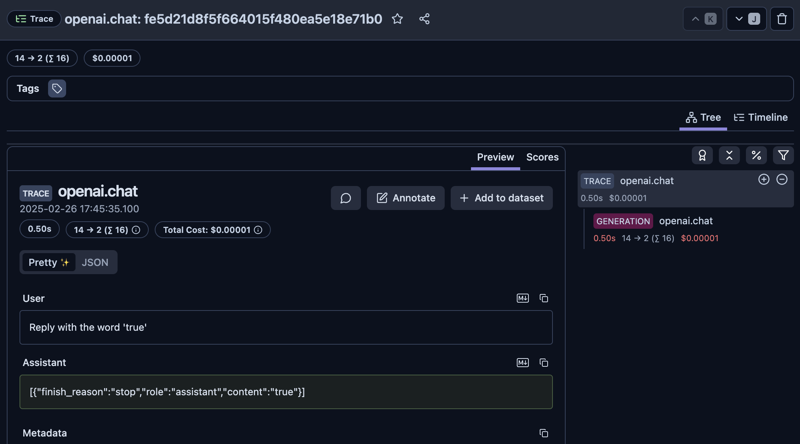

The docker-compose file in this repo is from https://github.com/langfuse/langfuse/blob/main/docker-compose.yml

# How to run (not working)

1. Ensure you are using at least Java 21
2. Start Langfuse with `docker compose up`. Open http://localhost:3000 in your browser to create a user and get API keys.
3. Configure env vars
    ```
    export SPRING_AI_OPENAI_APIKEY="sk-proj-xxx"
    export OTEL_EXPORTER_OTLP_ENDPOINT="http://localhost:3000/api/public/otel"
    export OTEL_EXPORTER_OTLP_HEADERS="Authorization=Basic $(echo -n "pk-lf-xxx:sk-lf-xxx" | base64)"
    ```
4. Run with `./mvnw clean install spring-boot:run`
5. Console output should print "Invoking LLM" and "AI answered: true"
6. If you execute `curl localhost:8080/v1/chat` you'll see the traceId and spanId in the console logs.
7. Note that the LangFuse web UI does not display traces.

### How to run with OpenTelemetry Agent (partially working)

1. It's assumed you've already exported above the env vars in this terminal tab.
2. This branch has the opentelemetry-javaagent.jar included. Start the app using this command that leverages the opentelemetry javaagent. `java -javaagent:src/main/resources/opentelemetry-javaagent.jar -jar target/demo-0.0.1-SNAPSHOT.jar`
3. Each time you execute `curl localhost:8080/v1/chat` a new trace is displayed in the Langfuse web UI. However, no LLM info or observations are captured which indicates the setup is only partially working.



### Working Python & Traceloop Example

1. It's assumed you've already exported above the env vars in this terminal tab.
2. Setup python dependencies
    ```
    python3 -m venv .
    source bin/activate
    pip install -r requirements.txt
    ```
3. Run the demo with `./traceloop_test.py`
4. Note how the LangFuse web UI includes traces with the LLM attributes, and that they are also recorded under the Observations tab.


